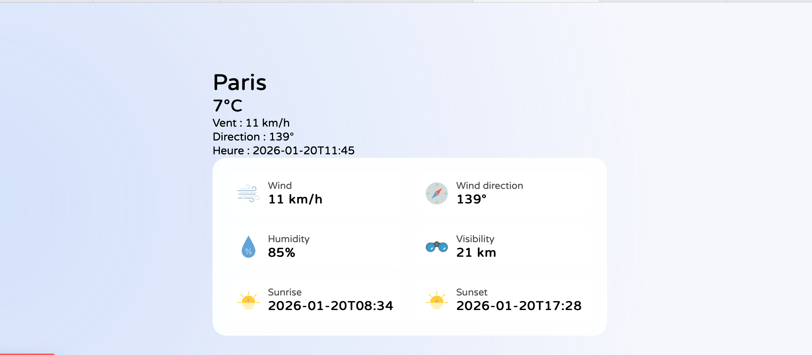

# Weather App

Application météo dédiée aux compagnies de transport permettant d’afficher les conditions météorologiques actuelles d’une ville configurée, basée sur l’API **Open-Meteo** et développée avec **Next.js / React**.

---

## Fonctionnalités

- Affichage de la météo actuelle via **Open-Meteo**
- Heure locale courante
- Température
- Vitesse et direction du vent
- Humidité
- Visibilité
- Heure du lever du soleil
- Heure du coucher du soleil
- Rafraîchissement automatique des données (toutes les heures)
- Gestion des états de chargement et d’erreur
- Interface moderne avec CSS Modules et icônes personnalisées

---

## Technologies utilisées

- **Next.js / React**
- **Open-Meteo API** (aucune clé API requise)
- **CSS Modules**
- **Fetch API**
- **JavaScript (ES6+)**

---

## Installation

### 1. Cloner le dépôt

\`\`\`bash
git clone https://github.com/choucha-cyber/weather-app.git
cd weather-app
\`\`\`

### 2. Installer les dépendances

\`\`\`bash
npm install
\`\`\`

### 3. Configurer la ville

Modifier le fichier :

\`\`\`bash
config/city.json
\`\`\`

Exemple de configuration :

\`\`\`json
{
  "city": "Paris",
  "latitude": 48.8566,
  "longitude": 2.3522
}
\`\`\`

### 4. Lancer l'application

\`\`\`bash
npm run dev
\`\`\`

L’application est accessible à l’adresse :  
**http://localhost:3000**

---

## API météo

Ce projet utilise l’API **Open-Meteo** :  
https://open-meteo.com/

### Pourquoi Open-Meteo ?

- Aucune clé API nécessaire  
- Service rapide et fiable  
- Utilisation gratuite pour les projets personnels et professionnels  

Les données météo sont récupérées via une route API **Next.js** :

\`\`\`
/api/data
\`\`\`

---

## Interface & icônes

- Icônes personnalisées stockées dans `public/icons`
- Interface de type *glassmorphism*
- Affichage optimisé pour écrans fixes (ex. écrans de transport)

---

## Auteur

Développé par **Mimouni Aïcha**  
Projet : formation CPA-DevOps - Simplon - 2026
